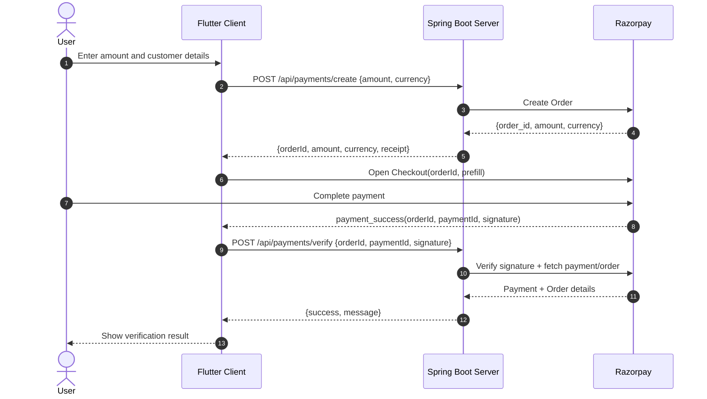

# Razorpay Demo (Flutter + Spring Boot)

This repository contains a complete Razorpay payment demo with:

- `client`: Flutter app that opens Razorpay Checkout and verifies payment.
- `server`: Spring Boot API that creates Razorpay orders and verifies signatures/payment details.

## Monorepo Layout

- `client/` Flutter mobile/web app.
- `server/` Java Spring Boot backend.

## Tech Stack

### Client

- Flutter (Dart SDK `^3.11.1`)
- `razorpay_flutter` for checkout UI
- `http` for backend calls
- `flutter_dotenv` for environment variables

### Server

- Java 25 (toolchain configured in Gradle)
- Spring Boot `4.0.3`
- Razorpay Java SDK `1.4.8`
- Gradle build

## High-Level Flow

1. User enters amount and customer details in Flutter app.
2. App calls `POST /api/payments/create` on backend.
3. Backend creates Razorpay order and returns `orderId`, amount, currency, receipt.
4. App opens Razorpay Checkout with returned order.
5. On success, app calls `POST /api/payments/verify` with order id, payment id, signature.
6. Backend verifies signature and validates payment/order consistency with Razorpay API.

## Sequence Diagram



## Prerequisites

- Flutter SDK installed and working (`flutter doctor` clean enough for your target).
- Java 25 installed (or available via configured Gradle toolchain).
- Razorpay account and API keys (test mode recommended for local development).

## Environment Configuration

### 1) Server secrets

The backend expects these environment variables:

- `RAZORPAY_KEY_ID`
- `RAZORPAY_SECRET`

They are read by `server/src/main/resources/application.yaml`:

- `razorpay.keyId: ${RAZORPAY_KEY_ID}`
- `razorpay.secret: ${RAZORPAY_SECRET}`

### 2) Client .env

Create `client/.env` with:

```env
# Backend base URL INCLUDING /api
BASE_URL=http://localhost:8080/api

# Razorpay key id used by checkout
RAZORPAY_KEY=rzp_test_xxxxxxxxxxxx
```

Important:

- `BASE_URL` must include `/api` because the app appends `/payments/create` and `/payments/verify`.
- Android emulator users often need `http://10.0.2.2:8080/api` instead of `localhost`.

## Run the Backend

From repo root:

### Windows (PowerShell or cmd)

```bash
cd server
set RAZORPAY_KEY_ID=rzp_test_xxxxxxxxxxxx
set RAZORPAY_SECRET=xxxxxxxxxxxxxxxx
.\gradlew.bat bootRun
```

### macOS/Linux

```bash
cd server
export RAZORPAY_KEY_ID=rzp_test_xxxxxxxxxxxx
export RAZORPAY_SECRET=xxxxxxxxxxxxxxxx
./gradlew bootRun
```

Default backend URL: `http://localhost:8080`

## Run the Flutter Client

From repo root:

```bash
cd client
flutter pub get
flutter run
```

The app entry is `client/lib/main.dart` and loads `.env` at startup.

## API Contracts

### Create payment order

Endpoint:

- `POST /api/payments/create`

Request body:

```json
{
  "amount": 49900,
  "currency": "INR"
}
```

Response body:

```json
{
  "orderId": "order_XXXXXXXXXXXXXX",
  "amount": 49900,
  "currency": "INR",
  "receipt": "rcpt_1740000000000"
}
```

### Verify payment

Endpoint:

- `POST /api/payments/verify`

Request body:

```json
{
  "razorpayOrderId": "order_XXXXXXXXXXXXXX",
  "razorpayPaymentId": "pay_XXXXXXXXXXXXXX",
  "razorpaySignature": "generated_signature"
}
```

Response body:

```json
{
  "success": true,
  "message": "Payment verified successfully"
}
```

## Tests

### Server

```bash
cd server
./gradlew test
```

(Windows: use `gradlew.bat test`)

### Client

```bash
cd client
flutter test
```

## Troubleshooting

- `Failed to create payment` from app:
  - Ensure backend is running.
  - Ensure `BASE_URL` is correct and includes `/api`.
- Signature verification failure:
  - Confirm server uses the same Razorpay account keys as checkout key in client.
- Android emulator cannot reach backend:
  - Use `10.0.2.2` instead of `localhost` in `BASE_URL`.
- App crashes on startup with dotenv errors:
  - Ensure `client/.env` exists and key names are exact.

## Security Notes

- Never commit real Razorpay secrets.
- Use test keys for local development.
- Consider a secret manager for non-local environments.

## Current Implementation Notes

- Backend creates a unique receipt as `rcpt_<timestamp>`.
- Verification checks:
  - signature validity,
  - payment status (`captured` or `authorized`),
  - order id match,
  - amount and currency match.
